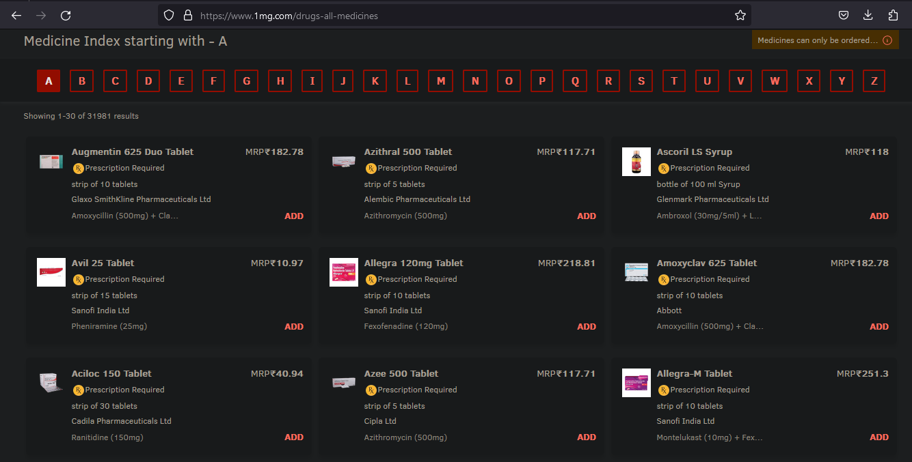
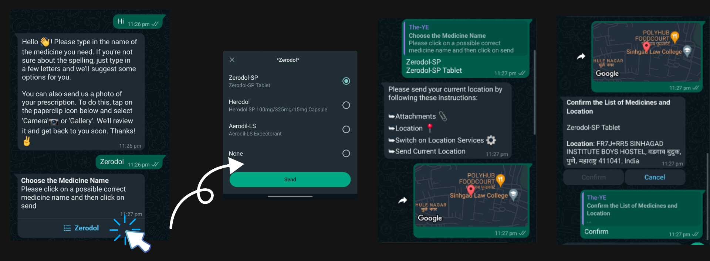
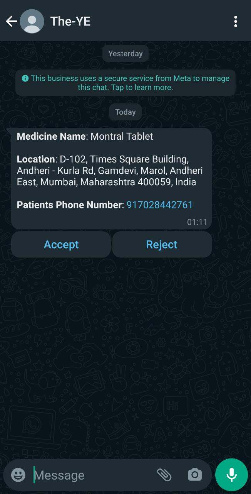
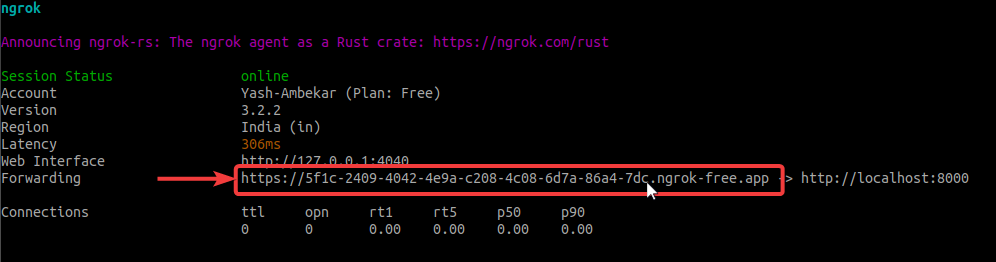
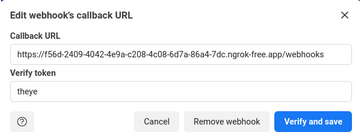

## The - YE  

Medicine delivery apps are popular but can be inconvenient due to limited availability, technical issues, and long delivery times. Instead, using a WhatsApp bot allows customers to order medicines conveniently without downloading a separate app or dealing with complex interfaces. This is what we aim to create. The bot connects users to medicine stores based on availability of medicines in nearby drug stores. WhatsApp's widespread availability on different devices gives the bot a distribution advantage over traditional delivery apps.

  
## Index
- [Tech Stack](#tech-stack)
- [Medicine Dataset](#medicine-dataset)
- [How it works](#how-it-works)
- [Steps to setup locally](#steps-to-setup-locally)
- [References](#references)
  


## Tech Stack 

| Name            | Description                                                                                               |
| --------------- | --------------------------------------------------------------------------------------------------------- |
| Whatsapp Business Cloud API    | Used in connecting the patient to the medical store through messenger chat                               |
| NodeJS           | All the backend processsing takes place inside the NodeJS Server. |
| Google Maps API          | Used to retrieve the coordinates and address of the patient and medical stores                 |                        |


## Dataset


This project employed web scraping techniques to create a JSON database from the Tata 1mg website, allowing us to obtain a comprehensive list of medicines. By utilizing this approach, we efficiently extracted the necessary data and organized it in a structured format. The resulting JSON database serves as a valuable resource for further functionalities such as searching and spelling correction within the scope of the project.

  

## How It Works

On the user end, the steps followed are as follows - 

1. The user initiates the conversation by sending a message such as “Hi” or “Hello”
2. As demonstrated in the figure below, the bot will reply with a greeting message with instructions regarding next steps to follow.
3. In the example below, the user sends “Zerodol” as the required medicine. The bot replies with a list of top 3 available medicine names in the database with an interactive option to choose
4. After choosing the medicine from the list, the medicine name is replied to the bot
5. The user is then prompted to send the location where he needs the medicine, this location is received by the bot which, with the help of Google Maps API, retrieves the address.
6. This address, along with the requested medicine, is then resent to the user to get confirmed
7. After confirmation, the information is sent to nearest stores for acceptance



On the Medicine store end, he will receive following - 

<p align = "center">

</p>

## Steps to setup locally
##### Setting up using Ngrok
#####  Please checkout the tech stack table before proceeding. 
  
**Step - 1**: Clone the github repository.  
```
git clone https://github.com/Yash-Ambekar/The-Ye.git
```  
  
**Step - 2**: Install Ngrok and set it up by following the simple steps mentioned on the Ngrok website [https://ngrok.com/download](https://ngrok.com/download)

**Step - 3**: Change your directory to ```server```  and run the following commands.  
To install dependencies.  
```npm i ```  
To start server on port 8000 using Nodemon.  
```npm run watch```  
  
**Step - 4**: Enter the following command to start Ngrok Tunnel  
```ngrok http 8000```  

**Step - 5**: Copy the tunnel link from the terminal interface  



**Step - 6**: Paste it on browser and visit it, then paste that same link with a ```/webhooks``` route and Verify Token as ```theye``` to configure webhook on the Meta Developer Page  
Example link -  
(https://developers.facebook.com/apps/{someid}/whatsapp-business/wa-settings/).  
  
<p align = "center">

</p>

**NOTE:** Also subscribe to the messages mentioned in the ‘Webhook Fields’ section just below ‘Callback URL’ after verifying the webhook callback URL.

**Step - 7**: Done! You are all set for testing the chatbot by sending “Hi” to the Test Number allotted to you by the Whatsapp Business API.

## References
[Whatsapp Cloud API](https://developers.facebook.com/docs/whatsapp/cloud-api)
[Whatsapp Cloud API Send Messages](https://developers.facebook.com/docs/whatsapp/cloud-api/guides/send-messages)
[Whatsapp Cloud Receive Message](https://developers.facebook.com/docs/whatsapp/cloud-api/webhooks/payload-examples)